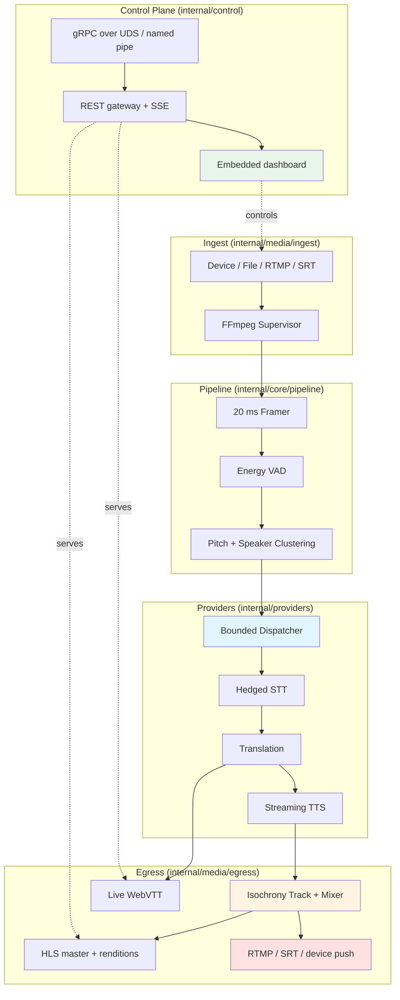

<p align="center">
  
</p>

# Prukka

> Self-hosted, real-time multilingual dubbing and interpretation engine — one live source in, N languages out as dubbed voice and live subtitles, entirely on your machine.

[](https://go.dev/)
[](https://github.com/ubyte-source/prukka/actions/workflows/ci.yml)
[](https://github.com/ubyte-source/prukka/actions/workflows/drivers.yml)
[](https://github.com/ubyte-source/prukka/actions/workflows/release.yml)
[](LICENSE)
[](cmd/prukka/default.pgo)

## ✨ Key Features

- 🌉 **One engine, three profiles** — broadcast dubbing, live-call interpretation and the desktop agent, session profiles of the same core, never three codebases
- 🗣️ **Dubbed voice + live subtitles** — every source re-emitted in N languages as HLS audio tracks and rolling WebVTT, side by side
- 🎨 **Color-coded speakers** — the subtitle rendition colors each speaker distinctly (from pitch clustering, no name labels) so viewers tell them apart at a glance
- 🎚️ **Automatic per-speaker voices** — a pure-Go pitch estimator clusters speakers and assigns each a register-matched voice, zero configuration
- 🧬 **Voice adaptation, two grades** — in-engine register matching re-pitches every take onto the speaker's measured fundamental (any backend, no key); optional cloud timbre cloning dubs each speaker in their *own* voice from a captured reference
- 🔒 **The network is the enemy** — all media and AI I/O stay local; a hosted dashboard only ever points at `127.0.0.1`, and a fully offline backend keeps even inference on the machine
- 🧠 **Two equal backends** — inference runs behind small, swappable ports (STT, MT, TTS) over hosted OpenRouter or any OpenAI-compatible server on your own machine (Ollama, whisper.cpp, LocalAI, LM Studio, vLLM) — no local GPU required
- ⚡ **Bounded provider dispatch** — a fixed worker pool over a lock-free MPMC ring caps concurrent paid calls across every session with backpressure
- 🛰️ **Hedged transcription** — a second STT fires past the observed p95 and the first answer wins, cutting tail latency
- 🎥 **Native virtual devices, per OS** — Prukka's own microphone, speaker and webcam for macOS, Linux and Windows, no third-party devices
- 💶 **First-class cost control** — per-session/language budgets pause the pipeline before spend runs away; cost is surfaced in CLI, tray and dashboard
- ⚙️ **PGO-optimized single binary** — one stripped, trimmed, profile-guided `prukka` executable; ffmpeg is the only runtime dependency and installs itself

## 🏗 Architecture Overview



### Core Components

| Component | Function |
|-----------|----------|
| **FFmpeg Supervisor** | The one package allowed to exec ffmpeg: supervised ingest (device/file/RTMP/SRT), a video tap, and encoded egress — installs a pinned static ffmpeg itself |
| **Framer + VAD** | Zero-allocation 20 ms framer feeding an energy voice-activity detector that segments utterances (fast endpointing on the call profile) |
| **Speaker Clustering** | Pure-Go YIN pitch estimator clusters speakers by register and assigns each a distinct preset voice |
| **Dispatcher** | Bounded worker pool over a lock-free MPMC ring, capping concurrent provider calls across all sessions, with backpressure and per-lane ordering |
| **Providers** | Consumer-side STT/MT/TTS ports; every backend adapter (OpenRouter, OpenAI-compatible local, Cartesia cloning) wrapped as breaker(hedge(retry(client))) |
| **Mixer** | Isochrony shaping, sidechain ducking and one shared clock so audio, subtitles and passthrough video stay in sync |
| **Egress** | Per-session HLS master (video passthrough + N audio + N subtitle renditions), rolling WebVTT, and RTMP/SRT/device pushes with optional burned-in captions |
| **Control Plane** | `prukka.v1.Control` gRPC over a UNIX socket / named pipe with per-install token auth, its REST mirror, SSE events and the embedded SPA |

## Quick Start

### Prerequisites

- A recent macOS, Linux or Windows machine (no GPU required)
- An [OpenRouter](https://openrouter.ai/keys) API key — **or** any OpenAI-compatible
  server on your machine (Ollama, whisper.cpp, LocalAI…) for the fully offline path
- Go 1.26+ *(only to build from source; the installer ships a prebuilt binary)*

### Installation

```bash
curl -fsSL https://prukka.ubyte.it/install.sh | sh    # macOS / Linux
irm https://prukka.ubyte.it/install.ps1 | iex         # Windows (PowerShell)
```

The installer downloads the release binary, installs ffmpeg (`prukka setup`)
and checks your environment. Then start:

```bash
prukka up                   # dashboard opens at http://127.0.0.1:8080/ui/
```

Everything else happens in the dashboard's **Settings** section: pick the
inference backend, choose the voice adaptation, tune budgets and privacy, and
paste provider API keys — keys go straight into the OS keychain, never into a
file. The CLI equivalent (`prukka key set openrouter`) remains for scripting.

### Local Execution

```bash
# Create a session: one source, three target languages
prukka session add demo \
  --in rtmp://0.0.0.0:1935/in/demo \
  --langs it,en,de

prukka session langs demo +fr -de   # hot add/remove languages
prukka session list
prukka stats                        # sessions, uptime, cost
prukka doctor                       # environment checks + fix hints
```

Install as a proper OS service (systemd / launchd / Windows service):

```bash
sudo prukka service install --now
```

### Build from Source

```bash
git clone https://github.com/ubyte-source/prukka.git
cd prukka
make tools        # pinned toolchain into .tools/bin
make build        # stripped, trimmed, PGO binary into bin/prukka
make dev          # daemon + dashboard on http://127.0.0.1:8080/ui/
```

## Configuration

Configuration precedence: **CLI flags** > **Environment variables** > **`config.yaml`** > **Defaults**

The config file lives at the platform default location (`prukka doctor` prints
it) or a path passed with `--config`. Provider keys are never stored here —
they live in the OS keychain as `keychain://` references.

### Daemon

| Field (`config.yaml`) | Environment Variable | Default | Description |
|---|---|---|---|
| `daemon.http` | `PRUKKA_HTTP` | `127.0.0.1:8080` | Dashboard + data-plane listen address (loopback) |
| `daemon.cors_origin` | — | `https://prukka.ubyte.it` | Allowed origin for the hosted dashboard |
| `daemon.media.rtmp` | `PRUKKA_MEDIA_RTMP` | `:1935` | RTMP ingest/egress bind |
| `daemon.media.srt` | `PRUKKA_MEDIA_SRT` | `:8890` | SRT ingest/egress bind |
| `control.remote` | `PRUKKA_CONTROL_REMOTE` | — | Point the CLI/tray at a non-default daemon socket |

### Providers

| Field (`config.yaml`) | Environment Variable | Default | Description |
|---|---|---|---|
| `providers.backend` | — | `openrouter` | Inference backend: `openrouter` (hosted) or `local` (on-machine, any OpenAI-compatible server) |
| `providers.clone` | — | `off` | Voice adaptation, layered over either backend: `off`, `pitch` (in-engine register matching, no key) or `cartesia` (cloud timbre cloning) |
| `providers.openrouter.key` | `PRUKKA_OPENROUTER_KEY` | `keychain://prukka/openrouter` | Key reference (set it with `prukka key set openrouter`) |
| `providers.openrouter.base_url` | — | `https://openrouter.ai/api/v1` | API base URL |
| `providers.openrouter.stt.model` | — | `openai/whisper-large-v3` | Speech-to-text model |
| `providers.openrouter.mt.model` | — | `google/gemini-2.5-flash` | Translation model (temperature `0.2`) |
| `providers.openrouter.tts.model` | — | `openai/gpt-audio-mini` | Streaming TTS model (`pcm16`) |
| `providers.openrouter.timeout` | — | `30s` | Per-call provider timeout |
| `providers.openrouter.eur_per_usd` | — | `1.0` | FX rate for cost reporting |
| `providers.local.base_url` | — | `http://127.0.0.1:11434/v1` | Shared OpenAI-compatible base; each stage falls back to it |
| `providers.local.stt` | — | `.../v1`, `whisper-1` | Transcription server (`base_url`) and `model` |
| `providers.local.mt` | — | `.../v1`, `llama3.1` | Translation server (`base_url`), `model`, `temperature` |
| `providers.local.tts` | — | `.../v1`, `tts-1` | Voice server (`base_url`), `model`, `voice`, `format`, `rate` |
| `providers.cartesia.key` | `PRUKKA_CARTESIA_KEY` | `keychain://prukka/cartesia` | Key reference (set it with `prukka key set cartesia`) |
| `providers.cartesia.base_url` | — | `https://api.cartesia.ai` | API base URL |
| `providers.cartesia.model` | — | `sonic-3` | Cloning TTS model |
| `providers.dispatch.workers` | — | `8` | Bounded dispatcher worker count |
| `providers.dispatch.queue` | — | `256` | Dispatcher queue depth |

The `local` backend is a first-class equal of the hosted one — same three
stages, same preset voice bank — that keeps every stage on the operator's own
machine. It speaks the standard OpenAI wire API, so Ollama, whisper.cpp's
server, LocalAI, LM Studio and vLLM all drive it unchanged; each stage carries
its own base URL, so transcription, translation and voice may live on three
different servers. See
[`internal/providers/local`](internal/providers/local/local.go).

Voice adaptation (`providers.clone`) layers over either backend in two grades.
`pitch` is in-engine register matching: the engine measures each speaker's
fundamental (the same YIN estimator that clusters speakers) and re-pitches
every dubbed take onto it — bounded to ±4 semitones so voices never warp — so
the dub sits at each speaker's own register with any backend, no key, no cloud.
`cartesia` is full timbre cloning through the cloud provider: each speaker is
cloned once from a reference of their own audio, then every take is synthesized
in that voice. Cloning a real person's voice requires their consent, which the
provider enforces. See
[`internal/providers/cartesia`](internal/providers/cartesia/cartesia.go).

### Session Defaults & Budgets

| Field (`config.yaml`) | Default | Description |
|---|---|---|
| `defaults.langs` | `[it, en]` | Target languages for a new session |
| `defaults.subs` | `vtt` | Subtitle mode: `off`, `vtt`, `burn` |
| `defaults.bed` | `-15dB` | Original-audio bed level under the dub |
| `defaults.delay` | `8s` | Output delay D that shifts every rendition onto one clock |
| `budgets.per_session_eur_h` | `3.0` | Spend ceiling per session/hour before the pipeline pauses |
| `privacy.store_transcripts` | `24h` | Transcript ring-buffer TTL (`0` disables storage) |

## What You Get Per Session

| Endpoint | What you get |
|---|---|
| `/{session}/master.m3u8` | One HLS: video passthrough + N audio tracks + N subtitle tracks |
| `/{session}/{lang}/index.m3u8` | Per-language HLS (dubbed audio) |
| `/{session}/{lang}/audio.ts` | Per-language audio-only MPEG-TS |
| `/{session}/{lang}/subs.vtt` | Live rolling WebVTT |
| `srt://…streamid=read:{session}/{lang}` · `rtmp://…/out/{session}_{lang}` | OBS-friendly pulls |
| `device://audio/<id>` · `device://video/<id>` | Push into a native Prukka virtual device (see [drivers/](drivers/)) |

## Native Virtual Devices

Prukka pushes dubbed audio and subtitled video into **virtual devices** so any
app — a browser, a call client, OBS — picks them up as a microphone, speaker or
webcam. Everything is Prukka's own code, built by each platform's native
toolchain; no third-party devices or build tools.

| | Microphone | Speaker | Webcam |
|---|---|---|---|
| **macOS** | HAL loopback (harness-gated) | HAL loopback | CoreMedia I/O extension |
| **Linux** | ALSA `snd-prukka-mic` | ALSA `snd-prukka-speaker` | V4L2 `prukka_webcam` |
| **Windows** | PortCls loopback | PortCls loopback | MF virtual camera (Win 11) |

Build and install instructions live in [drivers/](drivers/); the `device://`
URL scheme is documented in [docs/DEVICES.md](docs/DEVICES.md).

## Privacy

Audio segments and transcripts are sent to **OpenRouter and its routed
providers; nothing else leaves the machine.** No audio is stored by default;
transcripts live in a 24 h ring buffer; provider keys live in the OS keychain
(`keychain://` references), never in YAML. Cost per session/language is a
first-class feature, surfaced in the CLI, the tray and the dashboard. Details:
[docs/GDPR.md](docs/GDPR.md).

## Development

```bash
make build     # build ./bin/prukka (stripped, trimmed, PGO)
make test      # tests with the race detector
make lint      # the maintainer's linter — the law (zero nolint)
make gen       # regenerate protobuf/gRPC/gateway code
make web       # rebuild the embedded dashboard from web/
make demo-control   # the control-plane demo, end to end
```

The [Engineering Constitution](CONTRIBUTING.md#engineering-constitution) binds
every line in this repo: DRY, consumer-side interfaces, injected dependencies,
errors handled exactly once — and the maintainer's `.golangci.yml` is
**read-only**: code adapts to the linter, never the other way around. CI
enforces config integrity, a zero-suppression policy and race tests on every PR.

Architecture: [docs/ARCHITECTURE.md](docs/ARCHITECTURE.md) ·
Deployment: [deploy/](deploy/)

## 🛡️ Security

- **Loopback only** — the daemon binds `127.0.0.1`; a hosted dashboard drives it from the browser but media and configuration never touch the hosting server
- **Token-authenticated control plane** — gRPC over a UNIX socket / named pipe with a per-install token; the socket is mode `0600`, the token minted per install
- **Keys in the OS keychain** — provider keys are `keychain://` references resolved at use; `prukka doctor` warns on any plaintext key
- **Budgets** — per-session spend ceilings pause the pipeline before a runaway bill
- **Input validation** — language tags, URLs and config are validated at the boundary; a strict YAML decoder rejects unknown fields

For security policy and vulnerability reporting, see [SECURITY.md](SECURITY.md).

## Troubleshooting

### ffmpeg not found

**Symptom**: `prukka doctor` reports ffmpeg missing.

**Fix**: run `prukka setup` — it downloads a pinned static ffmpeg into the
state directory. Set `PRUKKA_DEMO_FFMPEG` to reuse an existing binary in demos.

### "lane unavailable" in the daemon log

**Symptom**: a session starts but no captions or audio appear.

**Fix**: the OpenRouter key is missing or invalid. Set it with
`prukka key set openrouter` and confirm with `prukka doctor` (the
`openrouter-key` check must resolve).

### Dashboard loads but shows "degraded"

**Symptom**: the SPA renders but the status pill is red.

**Fix**: the daemon is not reachable on `daemon.http`. Start it with
`prukka up` (or `prukka service install --now`) and confirm
`curl -fs http://127.0.0.1:8080/healthz`.

### A push never appears in the target

**Symptom**: `prukka session push` returns but nothing plays.

**Fix**: pushes need dubbed audio for the pair (dubbing on, ffmpeg installed);
device video pushes need the session's video rendition. Check the daemon log
for the honest "needs the session's video rendition" / "is dubbing on?" error.

## 🤝 Contributing

Contributions are welcome. Please fork the repository, create a feature branch,
and submit a pull request. For contribution guidelines and the Engineering
Constitution that binds this codebase, see [CONTRIBUTING.md](CONTRIBUTING.md).

---

## 🔖 Versioning

We use [SemVer](https://semver.org/) for versioning. For available versions, see
the [tags on this repository](https://github.com/ubyte-source/prukka/tags).

---

## 👤 Authors

- **Paolo Fabris** — _Initial work_ — [ubyte.it](https://ubyte.it/)

See also the list of [contributors](https://github.com/ubyte-source/prukka/contributors) who participated in this project.

## 📄 License

Apache-2.0. See [LICENSE](LICENSE) for complete terms.

## Naming & Credits

Prukka is Cimbrian — the Germanic minority language of the Asiago plateau — for
*bridge* (see [docs/BRAND.md](docs/BRAND.md)). A `cim` UI locale is welcome as
a community contribution.

---

## ☕ Support This Project

If Prukka has been useful for your work, consider supporting its development:

[](https://coff.ee/ubyte)

---

**Star this repository if you find it useful.**

For questions, issues, or contributions, visit our [GitHub repository](https://github.com/ubyte-source/prukka).
